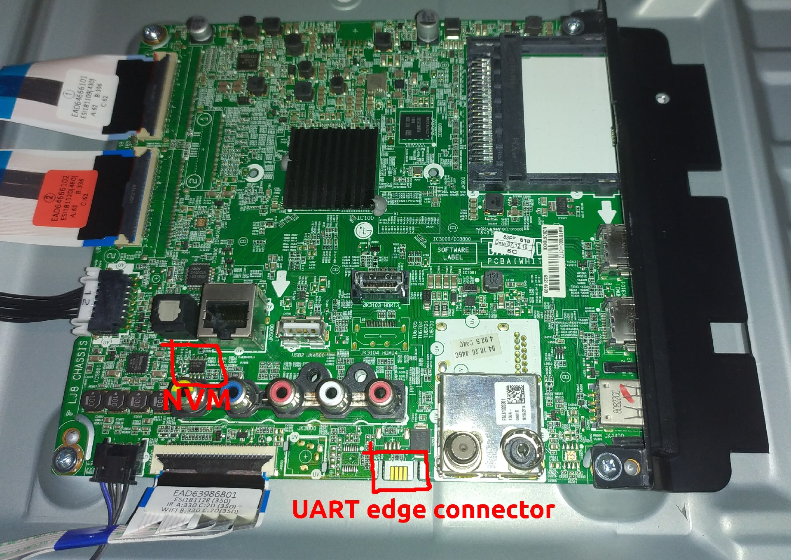
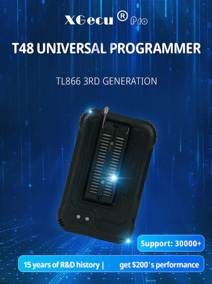
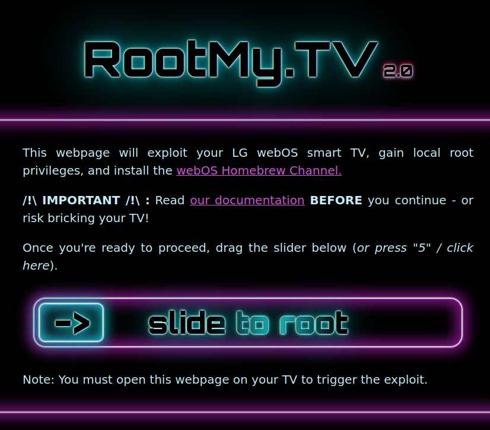

## Introduction

I have an LG smart TV at home which I bought around 2018 that has survived 3-4 apartment moves (
which in itself feels like an achievement). Though it still receives webOS updates fairly often,
there is some support from third-party apps that have started to drop. For example, HBO Max stopped
supporting my TV around 2021 which I thought was ridiculous, you expect a popular third-party app to
be supported for longer than 3 years from when you bought your fancy new TV .. right? If HBO Max can
drop support, what if other platforms like Netflix or Amazon also does it? Do I need to replace my
dumb living room monitor with another device or do I extend its life with a chrome cast?

Anyways, I instead started to look into how to cram out even more capabilities from my TV. This led
me to RootMyTV (V1), a straightforward way of rooting webOS LG TVs without having to use any
external device at all. Root access together with [*webosbrew*](https://repo.webosbrew.org/), an
unofficial webOS application store, unlocked more potential from my TV. I also started looking into
making webosbrew apps myself but never really finished anything that I want to make public *yet*.
Since then I have been on/off active in the openlgtv community.

Recently I looked into gaining root access *again*. I say again because my girlfriend accidentally
updated the TV to a newer webOS version that patched the previous vulnerability that I used to gain
root access. (I consider it my fault since I should have been more cautious and blockd all LG
software download OTA domains).

Here I am, back at it again!

**TV info dump:**
| Type | Description |
|:---------------:|:-----------------------------:|
| Model | 55UK6300PLB |
| webOS Version | 4.4.0-12 (goldilocks-gorce) |
| Chip type | LM18A (Mstar)               |
| S/W version | 05.40.26.01 |
| NVM EEPROM IC | FT24C256A |

## Modifying debugstatus in NVM

Before you read this do know that I took a huge detour on this root adventure when looking into how
to write to NVM. The NVM is what LG calls the EEPROM that stores configuration data used for
developer settings e.g. toggle logging, toggle UART serial, baud rates etc. Debugstatus is the "
flag" that determines whether to enable debug mode for a developer or perpetrator (me) to access
these
settings. [This page explains more in-depth on what NVM is and how to read and write to on older LG models](https://gist.github.com/throwaway96/827ff726981cc2cbc46a22a2ad7337a1#nvm)
.
I put some hours into researching how to do it, what software and tools I need and even went as far
as looking at the LG source code.

...Ultimately, the RootMyTV-way worked without me even noticing it so even though this section might
be interesting for people like me who get excited over embedded stuff, there isn't a payoff
here. [Skip to here]( #rootmytv) if you want to see the results of what gave me root access and what
I did after gaining root access.

### The Goal

Short overview of what I want to achieve:

1. Dump contents of NVM EEPROM
2. Verify that it matches the structure GPL structure i.e. find what address debugstatus is written
   to
3. Write to EEPROM override debugstatus RELEASE --> DEBUG
4. Enable UART in developer settings
5. Connect serial monitor to UART edge connector, verify that I have a root shell
6. [Activate persistant root mode](https://gist.github.com/throwaway96/827ff726981cc2cbc46a22a2ad7337a1#root-shell)
7. Install homebrew channel and verify persistant root status
   

#### Dump contents of NVM EEPROM

To modify NVM I need a device capable of writing to an EEPROM. I recently bought a universal
programmer tool that luckily supports read/write to the FT24C256A, which is my device's EEPROM.



*Look at all the lens flare such an amazing universal programmer!*

The T48 universal programmer 3G is not yet supported by minipro, an open-source program for
controlling the MiniPRO TL866xx series of chip programmers which has a great CLI interface that I
originally wanted to use (there is an open issue on supporting the
T48 [here](https://gitlab.com/DavidGriffith/minipro/-/issues/270)). Instead, I have to rely on the
program that came with it, *xgrpo.*

##### Running xgpro.exe on wine Ubuntu

1. Installation instructions for ubuntu: https://wiki.winehq.org/Ubuntu, at the time of writing I
   had to run these commands:

```bash
# Yes we need 32 bit architecture to run xgpro...
sudo dpkg --add-architecture i386

# Download and add the repository key
sudo mkdir -pm755 /etc/apt/keyrings
sudo wget -O /etc/apt/keyrings/winehq-archive.key https://dl.winehq.org/wine-builds/winehq.key

# Check Ubuntu version
lsb_release -sr

# I have 22.04 so I download that source
sudo wget -NP /etc/apt/sources.list.d/ https://dl.winehq.org/wine-builds/ubuntu/dists/jammy/winehq-jammy.sources

sudo apt update

sudo apt install --install-recommends winehq-stable
sudo apt install --install-recommends winehq-devel
```

2. Add an alias for running wine in either 32bit architecture (default 64bit)

```bash
alias wine32="WINEARCH=win32 WINEPREFIX='/home/$USER/.wine32' wine"
```

3. XGecu Xgpro software is annoying to download from the Chinese supplier's webpage. But I found and
   used [Kreeblah['s github mirror](https://github.com/Kreeblah/XGecu_Software/tree/master/Xgpro)
   where many release versions (if not all) are uploaded.

- Install Xgpro in Wine:

`wine32 ~/Downloads/xgproV1255_setup/XgproV1255_Setup.exe`

- Run installed binary:

`wine32 /home/$USER/.wine/drive_c/xgpro/Xgpro.exe`

- My suggestion is that you add an alias for running this binary:

`alias xgpro="wine32 ~/.wine/drive_c/xgpro/Xgpro.exe"`

Now you should be able to write and read to ICs that are supported by your EEPROM programmer.

#### Total failure?

My first few attempts to read did not go very well. I couldn't get my SOIC8 clip adapter for my T48
to get a good connection to the EEPROM and every read got me different results. I want to be sure
that my reading is stable enough to produce the same results every time before I even attempt to
write. **The ethernet **port was **conveniently** placed directly** next to the EEPROM so that my
SOIC8 clip was perfectly out of reach.** If I want a good connection I would either need to get a
smaller SOIC clip or solder on wires directly to the chip.

#### Verify GPL structure / Digging into the source

Before adding more risk of bricking my device I want to verify that it is even possible with my
firmware version + chip type combination. I decided to first consult the source code before
attempting any soldering or buying additional clips.

LG source code is available on  https://opensource.lge.com/ for download. Code snippets that I
downloaded from there are slightly modified below to be more easily read e.g. fixing their mixing of
spaces and tabs.

In `gpl_lm18a_MR_boot/boot/MstarCustomer/cmd/cmd_lg/cmd_nvm.c` we can see the system database (The
funny characters from the source code are not me). I have marked the line where we see debugstatus
is initialised to release level.

```cpp
const SYS_DB_T gSysNvmDB =
{
    0x20170707,
    DEFAULT_PRINT_MASK,
    0,        /* PDP panel use time */
    0,        /* FRC auto download or not */
    {50, 570, 33, 50, 50, 50}, /* panel powerseq */
    { 0, 0, 80,  5, 99, 99,  5, 35, 96, 120, 100, 22, 200,  0x0C }, /* panel pwm */
#if 0 //(SYS_ATSC)
    0,      /*system type 0:atsc, 1: dvb*/
#else
    1,      /*system type 0:atsc, 1: dvb*/
#endif
    1,      /**COLOR_DEPTH_T */
    1,      /**LVDS_PIXEL_T */
    0,        /*Vcom Pgamma value checksum */
    0xFF,
    0xFF,   /* SoftwareUpdate Mode */
    0xFF,   /* Make Hibernation Mode */
    0xFF,     /* Snap Shot Support or not */
    1,        /* ADC Mode [L9] Internal */
    0xFFFFFFFF, /* SWU Mode Magic Key */
    0,    /* sound out mode  */
    0xFFFFFFFF,    /* zram */
    0,            /* eMMCUsage */
    0,            /* bDPortEnable */
    0xff,        /* Secureboot full verify flag */
    0,            /* PWM Mode */
    0,            /* timeDifference */
    0,            /* LKCDEnable */
    0x43,        /* criu support or not */
    {0, 0, 0, 0, 0, RELEASE_LEVEL, 0, 0, 0, 0, 0, 0, 0, 0, 0, 0, 0, 0, 0, 0, 0, 0, 0, 0, 0, 0, 0, 0, 0, 0, 0, 0},
    0xFF,        /* Instant boot support or not */
    0,        /* Snapshot boot ART support or not */
};
```

...and in `gpl_lm18a_MR_boot/boot/MstarCustomer/include/lg_modeldef.h` the three different levels of
debugstatus are defined

```cpp
#define DEBUG_LEVEL    3
#define EVENT_LEVEL    4
#define RELEASE_LEVEL  5
```

The struct declaration for SYS_DB_T is located
in `gpl_lm18a_MR_boot/boot/MstarCustomer/include/cmnio_type.h`.

```cpp
/**
  *  System DB ¸ðµâÀ» À§ÇÑ ½ÇÁ¦ »ç¿ë type Á¤ÀÇ
  * (from os/common_linux/dil/include/dil_nvm.h)
*/
typedef struct
{
    UINT32               validMark;
    OSA_PRINT_MASK_T     printMask;
    UINT32               sys_utt;            /* PDP panel use time */
    UINT8                frcDownloadMode;    /* FRC auto download or not */
    PANEL_POWER_SEQ_T    panelpowerseq;        /* For panel power sequence timing */
    PANEL_PWM_T          panelpwm;            /* For panel pwm */
    UINT8                systemtype;         /*system type 0:atsc, 1: dvb*/
    UINT8                ColorDepth;            /**COLOR_DEPTH_T */
    UINT8                LVDSPixel;            /**LVDS_PIXEL_T */
    UINT8                vcomPgammaChecksum;    /*Vcom Pgamma value checksum */
    UINT8                nDebugStatus;        /* to apply encypted debugStatus feature (nEncyptedDebugStatus[32]), this param will be used no more. but it will be leaved for compatibility */
    UINT8                swuMode;            /* swu mode */
    UINT8                make_hib;            /* for snapshot boot (make building) */
    UINT8                snapshot_onoff;        /* for snapshot support or not*/
    UINT32               adcMode;            /* for adc Mode ÇöÀç ADC ¼³Á¤ °ªÀ» ÀúÀå  */
    UINT32               swum_magic;            /* swu mode magic */
    UINT8                soundout_mode;        /* soundout mode save 0:tv speaker, 1:external speaker 2:optical sound bar, 3:headphone,4:lineout,5;bluetooth soundbar */
    UINT32                zram;                /* zram */
    UINT8                eMMCUsage;            /* for eMMC Usage */
    UINT8                bDPortEnable;
    UINT8                fullVerify;            /* Secureboot full verify flag */
    UINT8                pwm_mode;            /* PWM mode */
    int                  timeDifference;
    UINT8                bLKCDEnable;        /* LKCD enable */
    UINT8                bCRIUEnable;        /* for criu support or not*/
    UINT8                nEncryptedDebugStatus[32]; /* do not refer to this param by "typeof". this should be use internally in dil layer only */
    UINT8                instant_onoff;        /* for instant boot */
    UINT8                snapshot_art;        /* for snapshot boot art*/

} SYS_DB_T;

```

The reason why `nEncryptedDebugStatus` is 32 bytes of zero paddings among 1 byte debugstatus is that
it is encrypted/decrypted before write/read. The encryption is AES-128 which I think uses a factory
flashed device key stored in eMMC conveniently out of reach for me. This is part of the Mstar secure
boot: `gpl_lm18a_MR_boot/boot/MstarApp/src/secure/MsSecureBoot.c` which I will not go into detail.

## RootMyTV v2

By using RootMyTV (sliding the slider) I got root access and homebrew channel installed.
I could verify root status "ok" in homebrew channel. The next step is to make sure I have remote
access as well.



To use my SSH pubkey authentication when connecting to the TV I had to enable telnet and manually
add my key first.

```
# After rebooting the TV I could run these commands
$ telnet webostv
$ mkdir -p /home/root/.ssh
$ chmod 700 /home/root/.ssh
$ echo '<ssh pubkey from ~/.ssh/id_rsa.pub>' > /home/root/.ssh/authorized_keys
$ chmod 600 /home/root/.ssh/authorized_keys
# Disable telnet and reboot TV again
$ ssh webostv

NEVER EVER OVERWRITE SYSTEM PARTITIONS LIKE KERNEL, ROOTFS, TVSERVICE.
Your TV will be bricked, guaranteed! See https://rootmy.tv/warning for more info.
root@webostv:~# 

```

My SSH config file (~/.ssh/config) contains this configuration:

```
host webostv
  HostName webostv
  User root
```

Where webostv hostname is configured in my router

### Blocking LG SW OTA domains

I have root again, great! Time to be more cautious this time and block all those ~~pesky~~ LG
domains that could remove my root access - *again*.
After rooting I blocked domains on my OpenWRT router to prevent webos updates. I compiled the list
of domains from openlgtv discord to be used by simple-adblock running on OpenWRT. The domain list
can be
found [here](https://gist.githubusercontent.com/kjeller/5c1f6aea1c5e6d5a70091a78b0eda6f2/raw/bda9a569c37bb794225f5af41c4f7c65ac598dab/hosts.txt)
and can be configured in simple-adblock in */etc/config/simple-adblock*:

```bash
config simple-adblock 'config'
	option config_update_enabled '0'
	option config_update_url 'https://cdn.jsdelivr.net/gh/openwrt/packages/net/simple-adblock/files/simple-adblock.conf.update'
	option dns 'dnsmasq.servers'
	option dns_instance '0'
	option verbosity '2'
	option force_dns '1'
	option led 'none'
	option boot_delay '120'
	option download_timeout '10'
	option curl_retry '3'
	option parallel_downloads '1'
	option debug '0'
	option compressed_cache '0'
	list blocked_hosts_url 'https://gist.githubusercontent.com/kjeller/5c1f6aea1c5e6d5a70091a78b0eda6f2/raw/bda9a569c37bb794225f5af41c4f7c65ac598dab/hosts.txt'
	option enabled '1'
```

## Final words

Huge thanks to the people over at openlgtv for providing all the necessary information. Even though
I failed with the "write to NVM strategy" I feel like I got some more insight into how my system
works. I would like to explore more devices using hands-on techniques like this and this was a nice
introduction to that. It is also a reminder to revisit options that were previously known to fail. I
feel like I tried RootMyTv v2 multiple times unsuccessfully before I decided to crack open my TV.
But lookie lookie it was an oversight from me.
